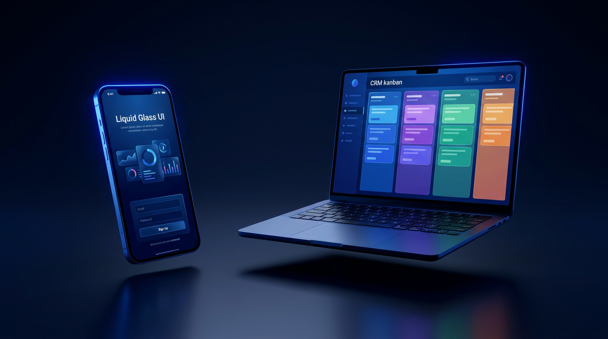

<!--
  Color de marca LEGENDAR·IA: azul #2a22f5 (sin dorado/coral del Club).
  Escribir SIEMPRE "Vercel". Tono: celebración + calma, cero-tech.
-->

# Kit AI Cash Machine

### Tu máquina de clientes, lista para encender 🔵

Bienvenido. Acabas de descargar el **Kit AI Cash Machine** del Módulo 2 de la Certificación **LEGENDAR·IA**.

Respira. No necesitas saber programar. No vas a romper nada. Aquí no hay nada que memorizar.

Esto es una **caja de herramientas ya armada**. Tú vas a copiar un texto (un "superprompt"), lo vas a pegar en una app llamada Claude Code, y esa app va a construir tu negocio digital por ti, pieza por pieza, mientras tú solo dices "sí, sigue".

> **La vara de medir de este kit:** si tu tío el de la taquería podría hacerlo siguiendo los pasos, está bien explicado. Y sí, puede.

---

## ✨ Lo que vas a tener al terminar (7 cosas)

Al final del kit, en internet, con tu nombre, vas a tener esto funcionando:

| # | Lo que tendrás | En palabras simples |
|---|---|---|
| 1 | **Página de captura / venta** | Tu aparador en internet: donde el cliente llega, te conoce y deja sus datos. |
| 2 | **Página de "gracias"** | La sonrisa después: lo que ve el cliente justo después de dejar sus datos. |
| 3 | **CRM en Supabase** | Tu **libreta de clientes en la nube**: cada persona que se registra queda guardada, segura, para siempre. |
| 4 | **Panel de administración** | Tu **caja registradora con vista de pájaro**: entras con tu clave y ves todos tus leads de un vistazo. |
| 5 | **Dominio propio** | El **letrero con tu nombre en la calle**: `tunegocio.com` en vez de una dirección rara. |
| 6 | **Publicado en Vercel** | Tu **restaurante abierto al público**: tu página deja de vivir solo en tu compu y la puede ver el mundo. |
| 7 | **Instalación guiada** | Un asistente que te lleva **de la mano**, paso por paso, sin que tengas que adivinar nada. |

Eso es todo un negocio digital. Lo que antes costaba miles de pesos y una agencia, aquí lo armas tú en una tarde.

---

## 🧰 Mapa del kit (qué hay en cada cajón)

Cuando abres esta carpeta ves varios "cajones" (carpetas). **No tienes que tocarlos a mano.** Claude Code los va a llenar y ordenar por ti. Esto es solo para que sepas qué es cada cosa, como el plano de una casa que aún no amueblas:

| Cajón / archivo | Para qué sirve |
|---|---|
| `README.md` | Este documento. La portada del kit (estás aquí). |
| `PASO-0.md` | El primer respiro: qué necesitas tener listo antes de empezar (tu compu, una cuenta de correo, 15 minutos). |
| `EMPIEZA-AQUI.md` | El **mapa con la X**: te dice exactamente cuál es el primer botón que tocas. Tu siguiente parada. |
| `tutoriales/` | Las guías con dibujos, paso a paso: crear tu cuenta, publicar en Vercel, conectar tu dominio. |
| `wizards/` | Los **asistentes de preguntas**: contestas cosas simples de tu negocio y el kit arma el texto mágico por ti. |
| `prompts/` | Los **superprompts** listos para copiar y pegar en Claude Code. El corazón del kit. |
| `app/` | El esqueleto de tu sitio web (página de captura, gracias, CRM, admin). Aquí vive lo que se construye. |
| `components/` | Las **piezas armables** de tu página (botones, tarjetas, formularios). Como los bloques de una construcción. |
| `lib/` | Los **engranes internos**: la lógica que hace que todo funcione por debajo. Ni lo abras, solo confía. |
| `supabase/` | El plano de tu **libreta de clientes en la nube** (cómo se guarda cada lead, con llave y seguro). |
| `assets/` y `public/` | Tus **imágenes y logos**: lo que se ve, los colores azules de la marca, tu identidad. |
| `scripts/` | Botones de mantenimiento automáticos. El kit los usa solo; tú no. |
| `docs/` | Notas extra y respuestas a "¿y si pasa esto?". Tu cajón de "por si las dudas". |

> Si abres un cajón y está vacío, **es normal**. Se llena cuando Claude Code construye tu negocio. Una casa empieza con cuartos vacíos antes de amueblarse.

---

## 🔵 ¿Por qué este kit y no otro?

Porque está hecho con piezas **profesionales de verdad**, las mismas que usan empresas grandes, pero ya conectadas y traducidas para ti:

- Tus clientes quedan guardados en una nube seria (Supabase), no en un Excel que se pierde.
- Tu **lista de clientes nunca queda expuesta** en internet. Está detrás de una **puerta con llave** (eso que los técnicos llaman RLS). Solo tú, con tu clave, la ves.
- Si todavía no conectas la nube, el kit corre igual en **"modo demostración"**: practicas sin miedo, sin que se pierda nada importante.
- Todo respeta la marca LEGENDAR·IA: azul, limpio, elegante. Tu negocio se ve caro desde el minuto uno.

---

## 🗺️ Por dónde empezar (en serio, solo esto)

No leas todo el kit. No hace falta. Haz **únicamente** estos dos pasos, en orden:

### 1) Abre `PASO-0.md`
Es tu lista de "antes de salir de casa": revisa que tengas tu computadora, una cuenta de correo y unos 15 minutos libres. Nada más.

**Si salió bien, deberías ver:** una lista corta de cosas, todas con palomita ✅, y la frase "ya estás listo para empezar".

### 2) Abre `EMPIEZA-AQUI.md`
Es el mapa con la X. Te dice cuál es el primerísimo botón que tocas y te entrega de la mano al primer tutorial.

**Si salió bien, deberías ver:** un solo botón o una sola acción clara que hacer, sin tener que elegir entre mil opciones.

> A partir de ahí, **cada pantalla te da un solo paso y un solo "ya quedó"**. Tú avanzas a tu ritmo. Si te trabas, en cada tutorial hay un recuadro de "¿y si veo un error?".

---

## 💛 Una última cosa antes de arrancar

Lo que vas a construir hoy mucha gente cree que es imposible sin un equipo de programadores. **No lo es.** Es como rentar un local y poner tu letrero: el plan gratis te alcanza de sobra para empezar, y los pasos están hechos para que **no te puedas perder**.

Vas a tropezar una o dos veces. Es normal. Cada paso te dice qué deberías ver en la pantalla para confirmar que vas bien, y si algo no cuadra, hay una nota que te explica qué hacer.

Tú solo sigue las flechas. El kit hace el resto.

**Tu siguiente paso:** abre `PASO-0.md`. Nos vemos del otro lado. 🔵

---

Kit AI Cash Machine · Módulo 2 · Certificación LEGENDAR·IA · Hecho para que cualquiera, sin saber programar, encienda su máquina de clientes.
